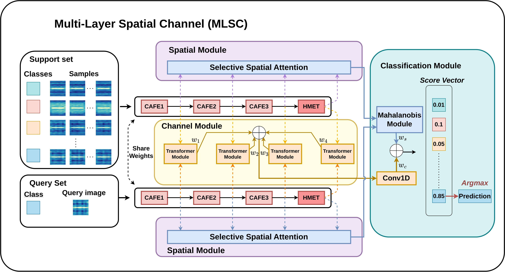
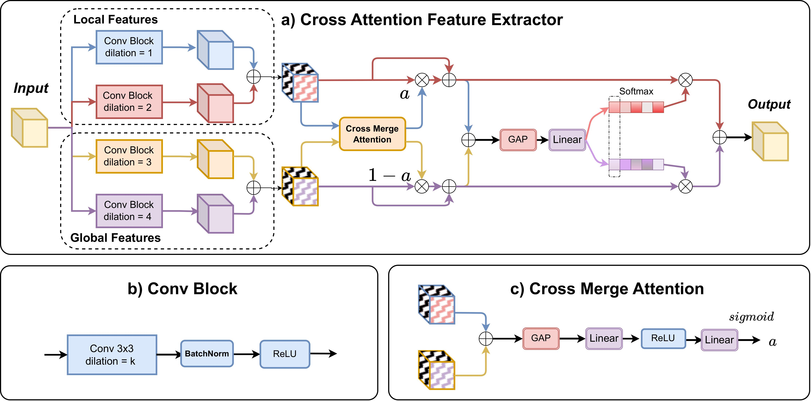
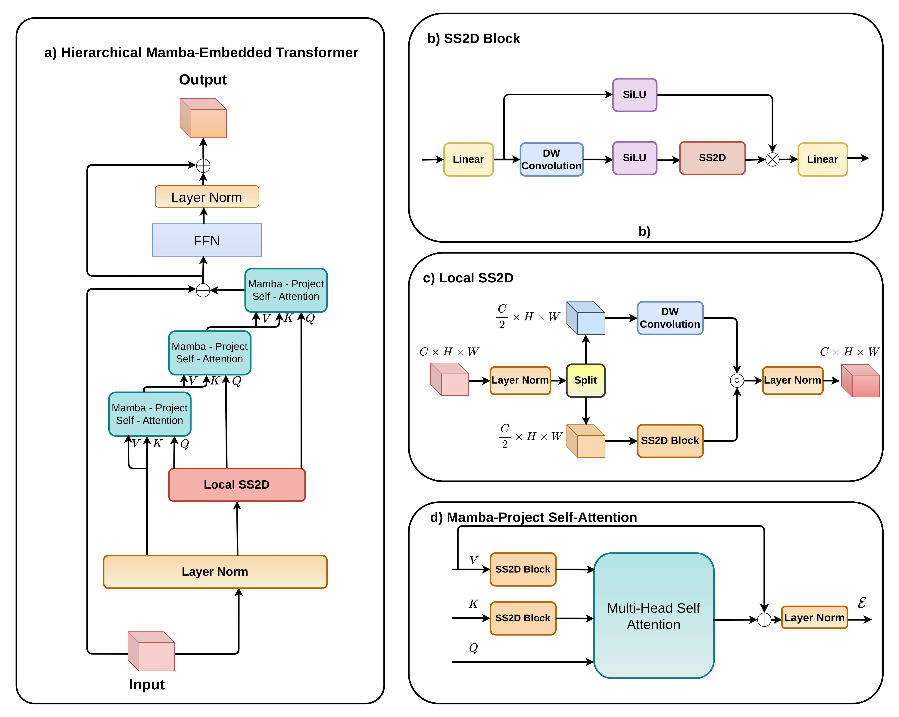
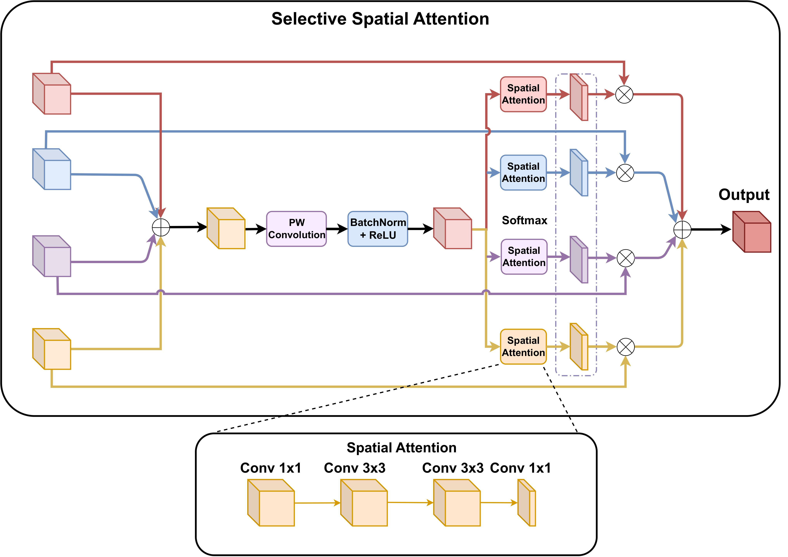
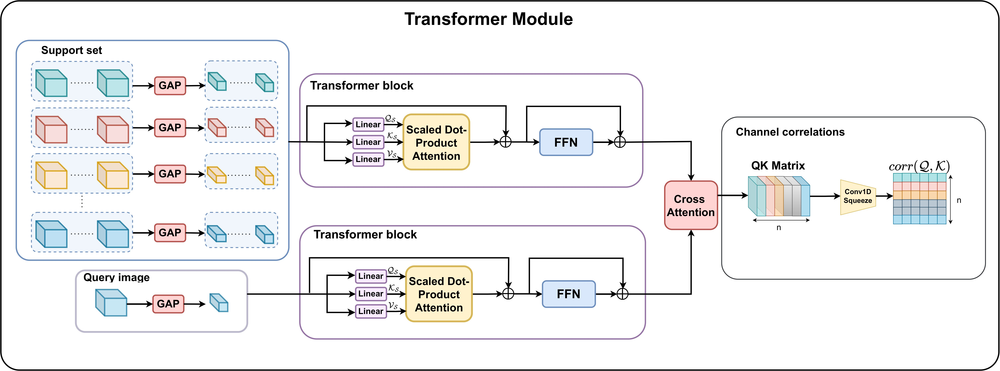

# Mitigating Feature Overlooking in Few-Shot Bearing Fault Diagnosis via Multi-Layer Attention-Guided Correlation across Spatial and Channel Dimensions

** Paper:** [https://link.springer.com/article/10.1007/s42417-026-02626-1]

---

## Methodology
We present a novel end-to-end few-shot learning framework, called Multi-Layer Spatial Channel (MLSC), which takes into account the correlation between the features of every layer, enabling the model to capture more general information. Moreover, new feature extraction blocks, called the Cross Attention Feature Extractor and the Hierarchical Mamba-Embedded Transformer (HMET), are also designed to learn both local and global features. In this study, we compare the similarity in both spatial and channel dimensions. The Mahalanobis metric is used for spatial correlation comparison, supported by the proposed Selective Spatial Attention block, which synthesizes information at all feature layers. For channel dimensions, the main idea is to compare the correlation at each layer, helping the model capture important information from the first to the last layers.

---
## Architecture of the proposed model

### Overall architecture of Multi-Layer Spatial Channel (MLSC)


### Cross Attention Feature Extraction (CAFE)


### Hierarchical Mamba-Embedded Transformer (HMET)


### Selective Spatial Attention (SSA)


### Transformer Module 

--- 
## Datasets 

This work evaluates performance on two benchmark bearing fault datasets:

- **CWRU** — Case Western Reserve University Bearing Dataset  
  https://engineering.case.edu/bearingdatacenter  

- **PU** — Paderborn University Bearing Dataset  
  [https://mb.uni-paderborn.de/kat/forschung/kat-datacenter/bearing-datacenter/data-sets-and-download](https://mb.uni-paderborn.de/kat/forschung/bearing-datacenter/data-sets-and-download)  


---
## Contact
If you have any questions about this reposition, you can contact me via emails:

viet.nvq222715@sis.hust.edu.vn or nguyenvanquocviet011@gmail.com

# Citation

If you feel this code is useful, please give us 1 ⭐ and cite our paper.
```bibtex
@article{nguyen2026mitigating,
  title={Mitigating Feature Overlooking in Few-Shot Bearing Fault Diagnosis via Multi-Layer Attention-Guided Correlation across Spatial and Channel Dimensions},
  author={Nguyen, Van-Quoc-Viet and Tran, Thi-Thao and Nguyen, Duy-Thai and Pham, Van-Truong},
  journal={Journal of Vibration Engineering \& Technologies},
  volume={14},
  number={7},
  pages={418},
  year={2026},
  publisher={Springer}
}
